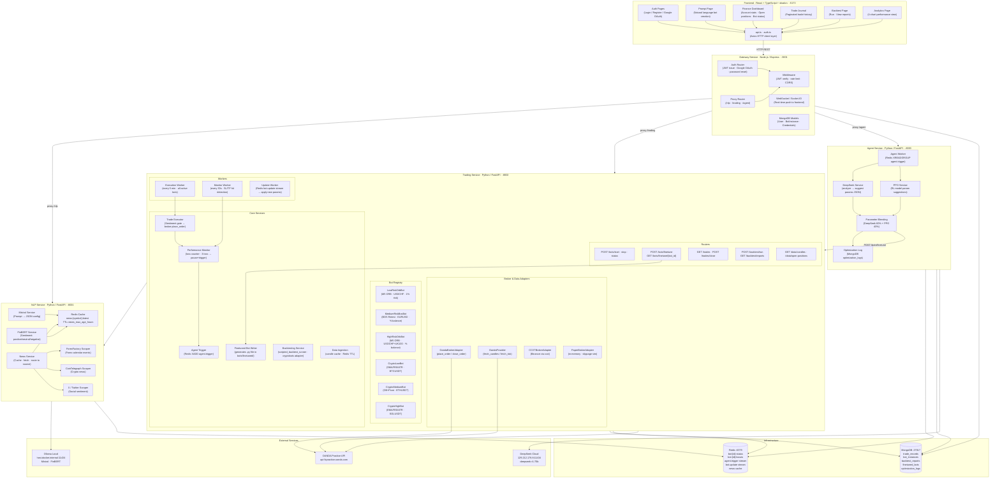

# TradePilot — Component Diagram

```mermaid
graph TB
    subgraph FRONTEND["Frontend  ·  React + TypeScript + shadcn  ·  :5173"]
        FE_AUTH["Auth Pages\n(Login / Register / Google OAuth)"]
        FE_PROMPT["Prompt Page\n(Natural language bot creation)"]
        FE_DASH["Finance Dashboard\n(Account stats · Open positions · Bot status)"]
        FE_JOURNAL["Trade Journal\n(Paginated trade history)"]
        FE_BACKTEST["Backtest Page\n(Run · View reports)"]
        FE_ANALYTICS["Analytics Page\n(4-chart performance view)"]
        FE_API["api.ts  ·  auth.ts\n(Axios HTTP client layer)"]
        FE_AUTH --> FE_API
        FE_PROMPT --> FE_API
        FE_DASH --> FE_API
        FE_JOURNAL --> FE_API
        FE_BACKTEST --> FE_API
        FE_ANALYTICS --> FE_API
    end

    subgraph GATEWAY["Gateway Service  ·  Node.js / Express  ·  :3001"]
        GW_AUTH["Auth Router\n(JWT issue · Google OAuth · password reset)"]
        GW_PROXY["Proxy Router\n(/nlp · /trading · /agent)"]
        GW_WS["WebSocket / Socket.IO\n(Real-time push to frontend)"]
        GW_MW["Middleware\n(JWT verify · rate limit · CORS)"]
        GW_MODELS["MongoDB Models\n(User · BotInstance · Credentials)"]
        GW_AUTH --> GW_MW
        GW_PROXY --> GW_MW
    end

    subgraph NLP["NLP Service  ·  Python / FastAPI  ·  :8001"]
        NLP_PARSE["Mistral Service\n(Prompt → JSON config)"]
        NLP_FINBERT["FinBERT Service\n(Sentiment: positive/neutral/negative)"]
        NLP_NEWS["News Service\n(Cache · fetch · route to source)"]
        NLP_FF["ForexFactory Scraper\n(Forex calendar events)"]
        NLP_CT["CoinTelegraph Scraper\n(Crypto news)"]
        NLP_X["X / Twitter Scraper\n(Social sentiment)"]
        NLP_REDIS["Redis Cache\nnews:{symbol}:latest  TTL=news_max_age_hours"]
        NLP_PARSE --> NLP_REDIS
        NLP_NEWS --> NLP_FF
        NLP_NEWS --> NLP_CT
        NLP_NEWS --> NLP_X
        NLP_NEWS --> NLP_REDIS
        NLP_FINBERT --> NLP_REDIS
    end

    subgraph TRADING["Trading Service  ·  Python / FastAPI  ·  :8002"]
        subgraph BOTS["Bot Registry"]
            BOT_LOW["LowRiskOrbBot\n(M5 ORB · USDCHF · 1% risk)"]
            BOT_MED["MediumRiskBosBot\n(BOS Retest · EURUSD · % balance)"]
            BOT_HIGH["HighRiskOrbBot\n(M5 ORB · USDCHF+UK100 · % balance)"]
            BOT_CL["CryptoLowBot\n(SMA/RSI/ATR · BTCUSDT)"]
            BOT_CM["CryptoMediumBot\n(OB+Pivot · ETHUSDT)"]
            BOT_CH["CryptoHighBot\n(EMA/RSI/ATR · SOLUSDT)"]
        end
        subgraph ADAPTERS["Broker & Data Adapters"]
            ADP_OANDA["OandaBrokerAdapter\n(place_order / close_order)"]
            ADP_OANDA_P["OandaProvider\n(fetch_candles / fetch_tick)"]
            ADP_CCXT["CCXTBrokerAdapter\n(Binance via ccxt)"]
            ADP_PAPER["PaperBrokerAdapter\n(in-memory · slippage sim)"]
        end
        subgraph SERVICES_T["Core Services"]
            SVC_EXEC["Trade Executor\n(Sentiment gate → broker.place_order)"]
            SVC_PERF["Performance Monitor\n(loss counter · 3-loss → pause+trigger)"]
            SVC_TRIG["Agent Trigger\n(Redis XADD agent.trigger)"]
            SVC_FTW["Finetuned Bot Writer\n(generates .py file in bots/finetuned/)"]
            SVC_BACK["Backtesting Service\n(scripted_backtest_runner · cryptobots adapter)"]
            SVC_DATA["Data Ingestion\n(candle cache · Redis TTL)"]
        end
        subgraph WORKERS_T["Workers"]
            WRK_EXEC["Execution Worker\n(every 5 min · all active bots)"]
            WRK_MON["Monitor Worker\n(every 30s · SL/TP hit detection)"]
            WRK_UPD["Update Worker\n(Redis bot.update stream → apply new params)"]
        end
        subgraph ROUTERS_T["Routers"]
            RT_BOTS["POST /bots/start · stop · status"]
            RT_FINE["POST /bots/finetune\nGET  /bots/finetune/{bot_id}"]
            RT_TRADE["GET /trades · POST /trades/close"]
            RT_BACK["POST /backtest/run\nGET  /backtest/reports"]
            RT_DATA["GET /data/candles · /data/open-positions"]
        end
        SVC_EXEC --> SVC_PERF
        SVC_PERF --> SVC_TRIG
        WRK_EXEC --> SVC_EXEC
        WRK_MON --> SVC_PERF
        RT_FINE --> SVC_FTW
    end

    subgraph AGENT["Agent Service  ·  Python / FastAPI  ·  :8003"]
        AGT_WORKER["Agent Worker\n(Redis XREADGROUP agent.trigger)"]
        AGT_DS["DeepSeek Service\n(analyze → suggest params JSON)"]
        AGT_PPO["PPO Service\n(RL model param suggestions)"]
        AGT_BLEND["Parameter Blending\n(DeepSeek 60% + PPO 40%)"]
        AGT_LOG["Optimization Log\n(MongoDB optimization_logs)"]
        AGT_WORKER --> AGT_DS
        AGT_WORKER --> AGT_PPO
        AGT_DS --> AGT_BLEND
        AGT_PPO --> AGT_BLEND
        AGT_BLEND --> AGT_LOG
    end

    subgraph INFRA["Infrastructure"]
        MONGO[("MongoDB :27017\ntrade_records\nbot_instances\nbacktest_reports\nfinetuned_bots\noptimization_logs")]
        REDIS[("Redis :6379\nbot:{id}:status\nbot:{id}:losses\nagent.trigger stream\nbot.update stream\nnews cache")]
    end

    subgraph EXTERNAL["External Services"]
        EXT_OANDA["OANDA Practice API\napi-fxpractice.oanda.com"]
        EXT_DS["DeepSeek Cloud\n129.212.178.8:11434\ndeepseek-r1:70b"]
        EXT_OLLAMA["Ollama Local\nhost.docker.internal:11434\nMistral · FinBERT"]
    end

    FE_API -->|"HTTP REST"| GATEWAY
    GATEWAY -->|"proxy /nlp"| NLP
    GATEWAY -->|"proxy /trading"| TRADING
    GATEWAY -->|"proxy /agent"| AGENT
    GATEWAY --> MONGO

    NLP --> EXT_OLLAMA
    NLP --> REDIS

    TRADING --> MONGO
    TRADING --> REDIS
    TRADING --> NLP
    TRADING --> EXT_OANDA
    ADP_OANDA --> EXT_OANDA
    ADP_OANDA_P --> EXT_OANDA

    AGENT --> REDIS
    AGENT --> MONGO
    AGENT --> EXT_DS
    AGT_BLEND -->|"POST /bots/finetune"| TRADING
```
