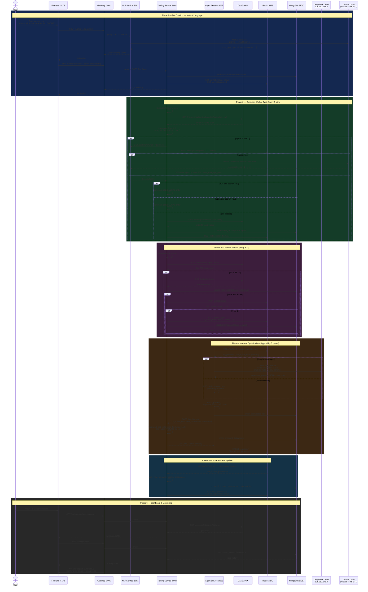

# TradePilot — Operational Diagram

```mermaid
sequenceDiagram
    actor User
    participant FE as Frontend :5173
    participant GW as Gateway :3001
    participant NLP as NLP Service :8001
    participant TR as Trading Service :8002
    participant AG as Agent Service :8003
    participant OANDA as OANDA API
    participant REDIS as Redis :6379
    participant MONGO as MongoDB :27017
    participant DS as DeepSeek Cloud<br/>129.212.178.8
    participant OLLAMA as Ollama Local<br/>(Mistral · FinBERT)

    %% ── Phase 1: User creates a bot via natural language prompt ──────────────
    rect rgb(20, 40, 80)
        note over User,OLLAMA: Phase 1 — Bot Creation via Natural Language
        User->>FE: Enter prompt e.g.<br/>"Create a low-risk forex bot for USDCHF"
        FE->>GW: POST /nlp/parse  { prompt }
        GW->>NLP: proxy → POST /parse
        NLP->>OLLAMA: Mistral inference<br/>prompt → JSON config
        OLLAMA-->>NLP: { bot_type, symbol, risk, timeframe, … }
        NLP-->>GW: parsed config JSON
        GW-->>FE: bot config
        FE->>GW: POST /trading/bots/start  { config, credentials }
        GW->>TR: proxy → POST /bots/start
        TR->>MONGO: insert BotInstance (status=active)
        TR->>REDIS: SET bot:{id}:status = active<br/>SET bot:{id}:losses = 0
        TR-->>GW: { bot_id, status }
        GW-->>FE: bot started
    end

    %% ── Phase 2: Execution Worker cycle (every 5 min) ───────────────────────
    rect rgb(20, 60, 40)
        note over TR,OLLAMA: Phase 2 — Execution Worker Cycle (every 5 min)
        TR->>TR: ExecutionWorker wakes
        TR->>OANDA: GET /instruments/{symbol}/candles?granularity=M5
        OANDA-->>TR: OHLCV candle array
        TR->>TR: bot.analyze(candles)<br/>→ signal: BUY | SELL | HOLD

        alt signal != HOLD
            TR->>NLP: GET /sentiment?symbol={symbol}
            NLP->>REDIS: check news:{symbol}:latest (TTL cache)
            alt cache miss
                NLP->>OLLAMA: FinBERT inference on latest headlines
                OLLAMA-->>NLP: sentiment score [-1 … +1]
                NLP->>REDIS: SET news:{symbol}:latest  TTL=news_max_age_hours
            end
            NLP-->>TR: { score, label }

            alt BUY and score < -0.3
                TR->>TR: sentiment gate BLOCKS order
            else SELL and score > +0.3
                TR->>TR: sentiment gate BLOCKS order
            else gate passes
                TR->>OANDA: POST /orders  { instrument, units, type }
                OANDA-->>TR: order fill confirmation
                TR->>MONGO: insert trade_record (status=open)
                TR->>REDIS: HSET bot:{id}:open_trades …
            end
        end
    end

    %% ── Phase 3: Monitor Worker cycle (every 30 s) ──────────────────────────
    rect rgb(60, 30, 60)
        note over TR,MONGO: Phase 3 — Monitor Worker (every 30 s)
        TR->>TR: MonitorWorker wakes
        TR->>OANDA: GET /accounts/{id}/openTrades
        OANDA-->>TR: live P&L per position

        alt SL or TP hit
            TR->>OANDA: PUT /trades/{id}/close
            OANDA-->>TR: close confirmation
            TR->>MONGO: update trade_record (status=closed, pnl)

            alt trade was a loss
                TR->>REDIS: INCR bot:{id}:losses
                TR->>REDIS: GET bot:{id}:losses → N

                alt N >= 3
                    TR->>REDIS: XADD agent.trigger *<br/>{ bot_id, bot_type, params, losses=3 }
                    TR->>MONGO: update BotInstance (status=paused)
                    TR->>REDIS: SET bot:{id}:status = paused
                end
            end
        end
    end

    %% ── Phase 4: Agent Worker responds to trigger ───────────────────────────
    rect rgb(60, 40, 20)
        note over AG,MONGO: Phase 4 — Agent Optimization (triggered by 3 losses)
        AG->>REDIS: XREADGROUP agent.trigger (blocking)
        REDIS-->>AG: trigger event { bot_id, bot_type, params }

        par DeepSeek analysis
            AG->>DS: POST /api/generate<br/>model=deepseek-r1:70b<br/>analyze(trade_history, params)
            DS-->>AG: suggested_params JSON + reasoning
        and PPO inference
            AG->>AG: PPO model forward pass<br/>→ param adjustments
        end

        AG->>AG: blend_params()<br/>DeepSeek 60% + PPO 40%

        AG->>MONGO: insert optimization_log
        AG->>TR: POST /bots/finetune<br/>{ bot_id, bot_type, new_parameters, reasoning }
        TR->>TR: finetuned_bot_writer.write_finetuned_bot()<br/>→ {bot_type}_finetuned_{ts}.py
        TR->>MONGO: insert finetuned_bots record
        TR-->>AG: { file_path, status: written }

        AG->>REDIS: XADD bot.update *<br/>{ bot_id, new_parameters }
    end

    %% ── Phase 5: Bot parameter hot-swap ────────────────────────────────────
    rect rgb(20, 50, 70)
        note over TR,REDIS: Phase 5 — Hot Parameter Update
        TR->>REDIS: XREADGROUP bot.update (UpdateWorker)
        REDIS-->>TR: { bot_id, new_parameters }
        TR->>TR: apply new_parameters to live bot instance
        TR->>MONGO: update BotInstance (parameters, status=active)
        TR->>REDIS: SET bot:{id}:losses = 0<br/>SET bot:{id}:status = active
    end

    %% ── Phase 6: User views dashboard ───────────────────────────────────────
    rect rgb(40, 40, 40)
        note over User,MONGO: Phase 6 — Dashboard & Monitoring
        User->>FE: Open Finance Dashboard
        FE->>GW: GET /trading/data/open-positions
        GW->>TR: proxy
        TR->>OANDA: GET /accounts/{id}/openPositions
        OANDA-->>TR: positions
        TR-->>FE: positions JSON

        FE->>GW: GET /trading/trades
        GW->>TR: proxy
        TR->>MONGO: query trade_records (paginated)
        MONGO-->>TR: trade history
        TR-->>FE: trade journal

        GW->>FE: WebSocket push (Socket.IO)<br/>real-time bot status · P&L updates
    end
```
